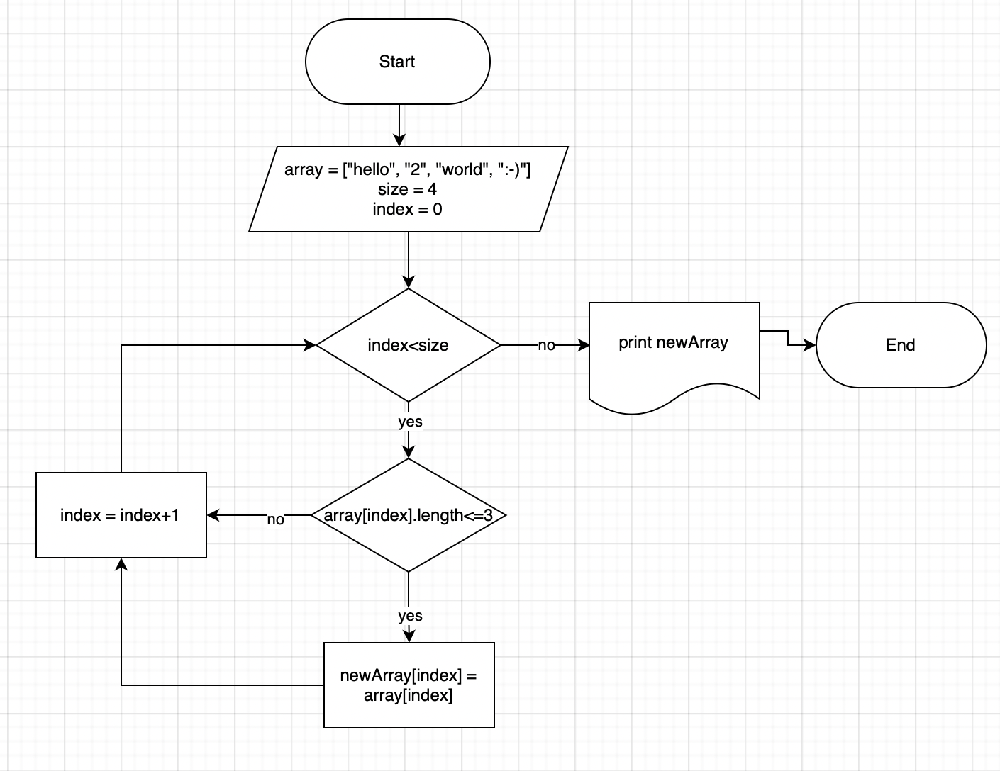

# Задача

Написать программу, которая из имеющегося массива строк формирует массив из строк, длина которых меньше либо равна 3 символа. Первоначальный массив можно ввести с клавиатуры, либо задать на старте выполнения алгоритма.

## Описание решения

1. Программе на вход подается массив с заданными элементами, а также новый пустой массив.

2. С помощью метода ShortArray проверяем каждый элемент массива. Если длина элемента массива меньше или равна 3, то записываем этот элемент в новый массив.

3. Метод ShortArray работает, пока счетчик меньше длины массива.

4. Как только будут проверены все элементы, выводим новый массив на печать.

## Блок-схема алгоритма

